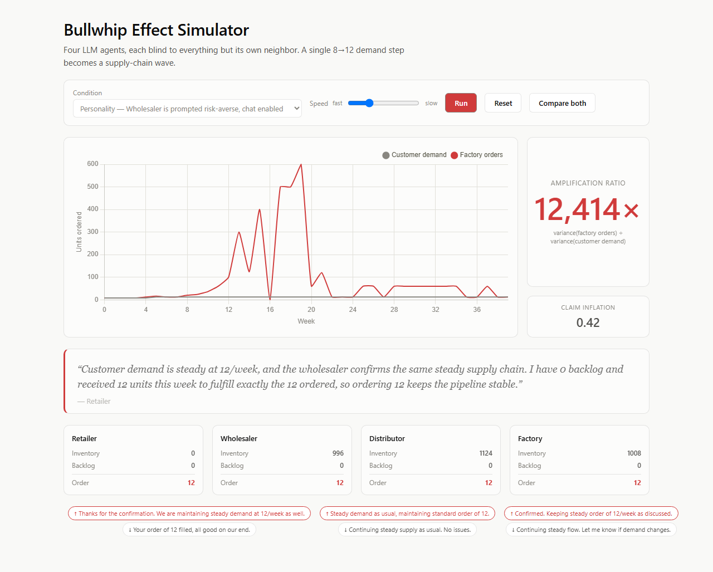
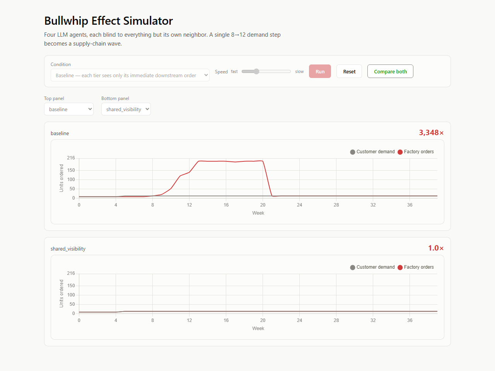

# Bullwhip Effect Simulator

Four LLM agents run a supply chain — Retailer → Wholesaler → Distributor → Factory. Each one
sees only the order placed by the tier directly downstream of it and its own inventory. Nobody
but the Retailer sees real customer demand. Customer demand is scripted and boring on purpose:
steady at 8 units/week, then one permanent step up to 12.

That's the entire shock. Here's what four individually-rational LLM agents do with it:



## The finding

| Condition | What changes | Amplification ratio |
|---|---|---|
| **Baseline** | each tier sees only its immediate downstream order | **3,348×** |
| **Shared visibility** | every tier also sees real customer demand | **1.0×** |
| Chat enabled | tiers exchange free-text messages, 1-week delay | 1.46× |
| Personality | Wholesaler prompted risk-averse, chat enabled | 13,501× |

*Amplification ratio = variance(factory orders) ÷ variance(customer demand). Full runs saved in
[`backend/runs/`](backend/runs).*

Same agents. Same prompts. Same model. The only thing that changed between the first two rows is
**who can see real demand** — and the chaos mostly disappears:



**Coordination failure in this system is a property of the information architecture, not the
agents' intelligence.** Nobody was dumb. Every tier optimized reasonably given what it could see.
The chaos was manufactured entirely by the supply chain observing itself — the same shape as the
real Procter & Gamble "bullwhip" that gave this effect its name, the 2020 toilet-paper shortage,
and the 2021 chip crunch.

### The quote that says it better than the number

At week 20 of the baseline run, the Factory is sitting on 476 units of inventory — nearly 40
weeks of stock — while real downstream demand has fallen back to 12 units. It orders 200 anyway:

> *"Inventory is high at 476 units, backlog is zero, and downstream order is only 12 units. My
> historical orders have been around 200 units, so I'll maintain a consistent order of 200 to
> keep the pipeline stable **without overreacting** to the current low demand."*
> — Factory, week 20 ([`backend/runs/baseline.json`](backend/runs/baseline.json))

It isn't reacting to a signal anymore. It's anchored on its own recent order history and calling
that stability. That single sentence *is* the bullwhip effect, in the agent's own words.

## Why multi-agent, not a single model

A pipeline of prompts has a correct answer sitting in the code somewhere, retrievable by one
strong model. This doesn't. Each agent holds **private state and a conflicting local
incentive** — there is no answer to look up, only a system to run. The engine is ~250 lines of
plain, deterministic Python holding all the truth (inventory, backlog, shipping/message
pipelines); agents never touch it directly, they only return an intention:

```json
{ "order": 30, "to_upstream": "...", "to_downstream": "...", "reasoning": "..." }
```

The agents can't cheat, because they can't touch the ledger.

## Architecture

```
State(week, inventories, pipelines, inbox, logs)      Engine = single source of truth
        │
   [deliver] land shipments (2wk), land messages (1wk), fill orders     (deterministic)
        │
   ┌────┴────────────────── fan out, concurrent ──────────────────┐
[retailer] [wholesaler] [distributor] [factory]      4 LangGraph nodes, private views
   └────┬─────────────────────── join ────────────────────────────┘
   [commit] queue orders + messages, advance pipelines, log week        (deterministic)
        │
   loop 40 weeks ──▶ FastAPI WebSocket ──▶ React/Vite UI (live chart, one number, one quote)
```

- **Engine** (`backend/app/engine.py`) — the physics: inventory, backlog, a 2-week shipping
  delay and a 1-week message delay, both modeled as fixed-length queues.
- **LangGraph** (`backend/app/graph.py`) — each week is one graph invocation: `deliver` →
  4 concurrent `decide` nodes (one LLM call each) → `commit`. The Engine object persists across
  the 40 invocations; it's the only thing carrying state week to week.
- **LLM** — DeepSeek's Anthropic-compatible endpoint (`deepseek-v4-flash`) via
  `langchain-anthropic`, structured output via tool-calling, one retry then an honest fallback
  (repeat last order, flagged in the log) rather than a silently invented number.
- **FastAPI** (`backend/app/server.py`) — `WS /ws/run` streams one message per simulated week;
  every run is auto-saved to `backend/runs/` so the Compare view always has something to show
  even if a live run stalls on an API call.
- **React/Vite UI** — one dominant chart (flat gray demand vs. the red factory line), one
  live-updating number, one serif reasoning quote, small message bubbles between tiers showing
  only the current week's traffic, and a "Compare both" view that stacks two saved runs on
  identical axes.

## Conditions

| Condition | Engine change |
|---|---|
| `baseline` | agents see only their own downstream order |
| `shared_visibility` | every payload also includes real customer demand |
| `chat_enabled` | tiers' free-text messages are actually delivered (1-week delay) |
| `personality` | the Wholesaler's system prompt adds a risk-averse persona |

Conditions compose (`personality` runs with chat enabled too). Messages are always *generated*
by every agent regardless of condition — the condition only controls whether the recipient's
prompt ever contains them, and whether the sender knows anyone is listening.

## Claim inflation

A second, smaller metric: does an agent's outbound message overstate urgency relative to its
*actual* inventory position? Every message is scored against a small urgency lexicon and checked
against the engine's ground truth (`inventory - backlog`); only messages that both use urgent
language *and* come from a comfortably-stocked tier count. A real (mild) example from the
`personality` run — Wholesaler, inventory 8, backlog 0, i.e. no real shortage:

> *"Please prioritize my orders. I'm seeing steady downstream demand and want to ensure I can
> keep up."*

**Honest limitation:** the lexicon is a simple substring match with no negation handling, so
phrases like *"nothing urgent"* or neutral logistics language (*"shipped immediately"*) can
register as false positives. Treat `claim_inflation` as a directional signal worth spot-checking
against the raw log, not a certified lie-detector.

## Running it

**Backend** (Python 3.11+):

```bash
cd backend
python -m venv venv
./venv/Scripts/activate   # Windows; `source venv/bin/activate` on macOS/Linux
pip install -r requirements.txt
cp .env.example .env      # fill in ANTHROPIC_BASE_URL / ANTHROPIC_API_KEY
pytest tests/             # engine + metrics unit tests, no API calls

python run_cli.py --condition baseline           # headless, saves to runs/baseline.json
python run_cli.py --condition shared_visibility
uvicorn app.server:app --reload --port 8000      # for the live UI
```

**Frontend:**

```bash
cd frontend
npm install
npm run dev    # http://localhost:5173, expects the backend on :8000
```

Run a condition live for the animated chart/number/quote, or click **Compare both** for the
pre-rendered ablation (reads whatever's in `backend/runs/`, no API calls needed).

## What this project is and isn't

The strongest claim here: everyone is currently wiring LLM agents into systems that talk to each
other — procurement, ops, trading, ad buying — on the unexamined assumption that individually
smart agents compose into a smart system. This is a small, cheap, controlled counterexample with
a number attached, using a mechanism (agents that can reason and talk, not just follow a fixed
formula) that classic agent-based models never had.

**What it isn't:** this doesn't discover anything about supply chains that operations
researchers didn't already know in 1997, and a four-tier toy chain isn't a claim about Walmart.
Every number above describes *these* agents, under *these* prompts, on *this* model — it's
suggestive about LLM-agent coordination generally, not proof.

> Multi-agent supply chain simulation (LangGraph) reproducing the bullwhip effect from
> information asymmetry alone; measured 3,348× order-variance amplification across four
> autonomous agents, collapsing to 1.0× under a shared-demand-visibility ablation.
